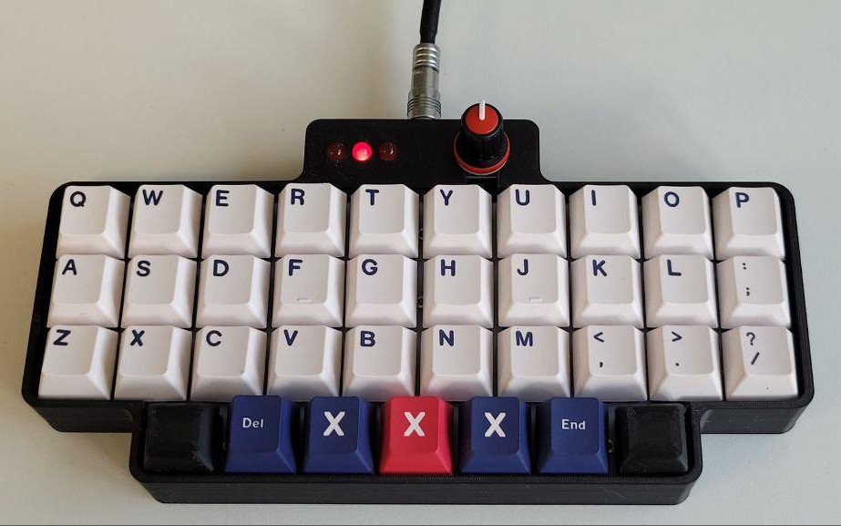
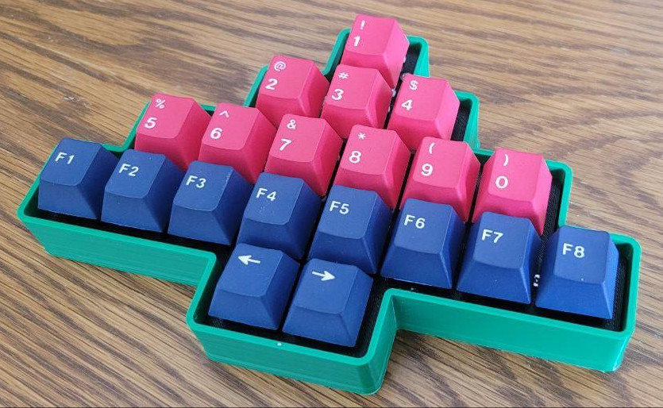

Alpinist generates parametric keyboards with arbitrary numbers of keys on each row using Python's [cadquery](https://github.com/CadQuery/cadquery) 

Inspired by [cq_keyboard_gen](https://github.com/mryndzionek/cq_keyboard_gen) and [Joe Scotto's Alp keyboard](https://scottokeebs.com/blogs/keyboards/scottoalp-handwired-keyboard)

# Example HOWTO

