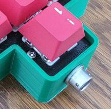

The Alpinist project generates parametric keyboards with arbitrary numbers of keys on each row using Python's [cadquery](https://github.com/CadQuery/cadquery).


The keyboards are hand wired and the plate is screwed to the case via countersink screws (by default M2). 

There is the option to put a small aviator connector on the front of the case. 



As well as adding a box to house a microcontroller with optional LEDs and rotary encoder.


Inspired by [cq_keyboard_gen](https://github.com/mryndzionek/cq_keyboard_gen) and [Joe Scotto's Alp keyboard](https://scottokeebs.com/blogs/keyboards/scottoalp-handwired-keyboard)

# HOWTO

To make your very own keyboard, define the number of keys on each row. Here is a keyboard with 2 rows of 5 keys and a third row of 10 keys:
```
config_string = """
{"row_key_numbers": [
        5,
        5,
        10
    ]
}"""
```

Then make the case and plate like so:

```
config = read_config_from_json(string=config_string)

case = make_case(config,
                 modify_controller_box=None,
                 cut_hole_for_connector=None)

plate= make_plate(config)
```

The `config` has many more customisable parameters, see [config.py](./factory/config.py) for more info. 
